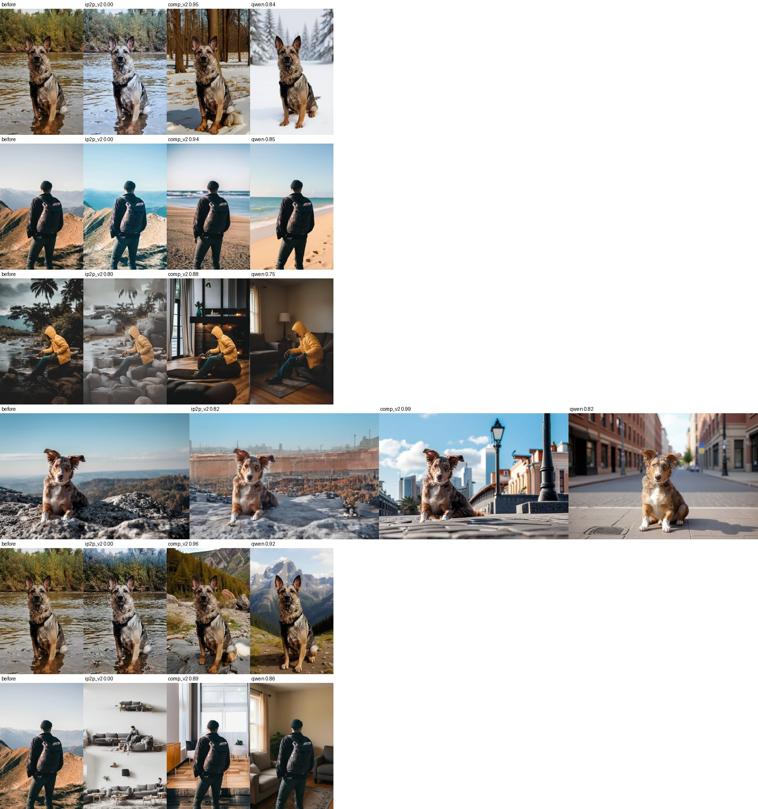

# Self-Improving Background Editor

[](LICENSE)
[](https://www.python.org/)
[](https://pytorch.org/)
[](tests/)

A closed-loop **background replacement** system. It swaps the scene behind a person or dog so that the
subject stays unchanged **and** stays physically coupled to the new scene: support, contact shadow, lighting
and clean edges. Instead of trusting one editor in one shot, it scores every candidate with a bank of
critics, diagnoses what is wrong, and re-edits.

```
before ─► EditSpec ─► perception (cached) ─┐
                                           ▼
   ┌── editor (N seeds) ─► after ─► perception ─► regions S/B/C/G ─► critics ─► gated aggregation ──┐
   │                                                                                                │
   └──────── router: issue type ─► action (prompt clause / parameter nudge / reseed) ◄──────────────┘
                      ▲ cross-sample action memory (UCB on Δscore)
```

## Contents

[Results](#results) · [Critics](#critics) · [Installation](#installation) · [Usage](#usage) ·
[Running on CHTC](#running-on-chtc) · [Project layout](#project-layout) · [Testing](#testing) ·
[Documentation](#documentation) · [Contributing](#contributing) · [License](#license)

## Results

All numbers come from the 15-image dataset (adult / dog, sitting / standing, river / mountain) with 6 target
backgrounds (snow, beach, city, forest, indoor, mountain), a budget of 12 edits per task, and critics v2.
Details: [`docs/results/`](docs/results/).

### Photo comparison of the three editors

Each row is one task. Columns: the original photo, **InstructPix2Pix** (`ip2p`), the **compositing baseline**
(SAM mask + SDXL inpainting, `comp`), and **Qwen-Image-Edit** (`qwen`). The number above each image is the
final critic score (0–1; `0.00` means a gate fired, i.e. the edit was rejected).



What the pictures show:

* **ip2p** rarely replaces the background. It restyles the whole image (cooler tint for "snow", green tint
  for "forest", a floor plan of sofas for "indoor"), so the gate scores most of those as failures.
* **comp** always replaces the background and keeps the subject pixel-exact, but the new scene can be
  physically odd (objects hugging the subject outline, weak support under the feet).
* **qwen** gives the most coherent scenes (real shadows, consistent perspective) while preserving the subject;
  it needs an 80 GB GPU.

### Quantitative comparison

On the 6 tasks of `adult_sit_river_01` (one source photo, all six targets), same 12-edit budget:

| editor | gate passed | median score | mean score | median score of round 0 |
|---|---|---|---|---|
| InstructPix2Pix | 5 / 6 | 0.73 | 0.61 | 0.00 |
| Compositing (SAM + SDXL inpaint) | **6 / 6** | **0.89** | **0.90** | 0.81 |
| Qwen-Image-Edit | **6 / 6** | 0.84 | 0.83 | 0.78 |

Full 90-task runs (critics v1, then re-scored with critics v2):

| | ip2p | comp |
|---|---|---|
| gate passed (v1 → v2 → semantic gate) | 79 → 63 → 55 / 90 | 90 → 90 / 90 |
| median overall score (v1 → v2) | 0.672 → 0.669 | 0.913 → 0.949 (0.879 with world softmin) |
| comp beats ip2p | | 90 / 90 |
| tasks improved by the refinement loop | 62 / 90 (mean +0.35) | 4 / 90 (already above threshold) |

### Do the critics detect physical violations? (E1)

Per-critic AUROC on a controlled violation suite (a clean paste vs the same photo with one injected violation):

| critic | float | sink | scale↑ | scale↓ | no shadow | colour cast | halo |
|---|---|---|---|---|---|---|---|
| `support` (depth) | **0.85** | 0.51 | 0.49 | 0.52 | 0.65 | 0.52 | 0.38 |
| `light_harmony` | 0.47 | 0.46 | 0.52 | 0.55 | 0.53 | **1.00** | 0.44 |
| `halo` | – | – | – | – | – | – | **0.97** |
| `vlm_integration` | 0.72 | 0.48 | 0.53 | **0.88** | 0.49 | 0.72 | 0.82 |
| `vlm_surface` | **0.79** | 0.47 | 0.67 | 0.65 | 0.71 | 0.67 | 0.60 |

Heuristic critics are sharp but narrow, VLM critics are broad but weaker, so they are combined. Two honest
negative results: **missing contact shadows** and **slight sinking** are not detected by any critic yet.

## Critics

| branch | critic | what it measures | region |
|---|---|---|---|
| **gate** | `subject_count` | exactly the original number of subjects (no missing / hallucinated extra) | — |
| | `identity` | DINOv2 CLS cosine of masked subject crops | S |
| | `bg_changed` | the background really changed (blocks the "return the input" reward hack); graded score also counts in *follow* | G |
| **keep** | `silhouette` | mask IoU after alignment (identity unless the subject moved); parts revealed from under the old scene (legs out of water) are not penalised | S |
| | `appearance` | Lab distance **after removing global lighting / colour cast** (lighting may change, texture may not) | S |
| | `texture` | DINOv2 patch cosine on the subject | S |
| **follow** | `bg_semantic` | SigLIP zero-shot: target vs all other backgrounds, subject removed | G |
| | `old_bg_residue` | source-scene concepts (e.g. water) left in the background | G |
| **world** | `support` | depth continuity between the subject's lowest pixels and the ground below | C |
| | `contact_shadow` | luminance heuristic — **ablation only** (AUROC 0.36 on E1), replaced by `vlm_shadow` | C |
| | `light_harmony` | subject highlights share the scene illuminant colour, relative to the real photo | S, G |
| | `halo` | ring around the subject still looks like the old scene | B |
| **world (VLM)** | `vlm_support` `vlm_shadow` `vlm_surface` `vlm_integration` `vlm_lighting` | Qwen2.5-VL P(yes) on region-boxed questions, relative to the real photo (CHTC config) | C, S, full |
| **follow (VLM)** | `vlm_background` | "Is the background a {target}?" | full |

Aggregation (`aggregation.method`): `gated_geometric` (any catastrophic critic → 0, else geometric mean of
keep/follow/world) or `weighted_sum` (legacy baseline, always logged as `weighted_sum_baseline`).

## Installation

Requirements: Python 3.10+ (developed on 3.12), a CUDA GPU (8 GB is enough for the default config; Qwen-Image-Edit
needs ~80 GB), about 13 GB of disk for model weights.

```bash
git clone https://github.com/Sherry1247/self_improving_editor.git
cd self_improving_editor
python -m venv .venv
.venvScriptsctivate                 # Linux / macOS: source .venv/bin/activate
pip install torch torchvision --index-url https://download.pytorch.org/whl/cu128   # RTX 50xx needs cu128+
pip install -r requirements.txt
python experiments/download_models.py   # ~13 GB into the Hugging Face cache
```

## Usage

```bash
# 0. if anything runs out of memory: per-model GPU/RAM usage report
python experiments/check_env.py

# 1. downscale originals + cache before-perception; check runs/prepare/*_regions.jpg
python experiments/prepare_data.py

# 2. smoke test: one image, one target
python experiments/run_loop.py --name smoke --samples dog_sit_river_01 --targets snow --save-candidates

# 3. full runs (15 images x 6 targets = 90 tasks)
python experiments/run_loop.py --name ip2p
python experiments/run_loop.py --name comp   --set loop.editor=compositing
python experiments/run_loop.py --name oneshot --set loop.max_edits=1 --set loop.n_candidates=1

# 4. E1 — do the critics see physical violations? (per-critic AUROC)
python experiments/critic_auroc.py --name e1

# score any existing pair
python experiments/evaluate_pair.py --before a.jpg --after b.jpg --object dog --action sit --background river --target snow
```

Every task writes `runs/<name>/<task>/{before.png, best.png, panel_best.jpg, report.json}`;
`runs/<name>/summary.csv` has one row per task. Any config key can be overridden with `--set a.b=value`.

## Running on CHTC

On the submit server (`ssh <netid>@ap2001.chtc.wisc.edu`):

```bash
git clone https://github.com/Sherry1247/self_improving_editor.git && cd self_improving_editor
bash chtc/pack.sh                                                      # code + images -> chtc/payload.tar.gz
condor_submit chtc/job.sub MODE=check RUN=check1 LIST=jobs/one.txt     # 1. GPU / memory sanity check
condor_submit chtc/job.sub MODE=loop  RUN=smoke  LIST=jobs/smoke.txt EXTRA="--targets snow --save-candidates"
condor_submit chtc/job.sub MODE=loop  RUN=ip2p   LIST=jobs/samples.txt # 15 jobs, 90 tasks
condor_submit chtc/job.sub MODE=loop  RUN=comp   LIST=jobs/samples.txt EDITOR=compositing
condor_submit chtc/job.sub MODE=loop  RUN=qwen   LIST=jobs/samples.txt EDITOR=qwen_edit GPUMEM=75000M DISK=120GB
condor_submit chtc/job.sub MODE=auroc RUN=e1     LIST=jobs/one.txt     # critic AUROC on all samples
bash chtc/pack_rescore.sh ip2p comp                                    # re-score finished runs with current critics
condor_submit chtc/job.sub MODE=rescore RUN=rescored LIST=jobs/one.txt EXTRA_IN=,chtc/rescore_in.tar.gz
condor_q                                                               # watch; logs in chtc/logs/
bash chtc/collect.sh ip2p                                              # unpack results -> runs/ip2p/summary.csv
```

Each job pulls the container's PyTorch, pip-installs `requirements.txt` into a venv and downloads the
models it needs from Hugging Face into its scratch dir (nothing is stored in your CHTC home).
Re-run `chtc/pack.sh` after every `git pull`.

## Project layout

```
configs/        default.yaml (8 GB laptop), chtc.yaml (overrides)
src/spec/       EditSpec: subject, source/target background, invariants & covariants
src/data/       labels.csv -> tasks, image loading (EXIF, aspect-preserving resize, cache)
src/models/     ModelRegistry (load once; per-model GPU policy keep / swap / unload), loaders
src/perception/ Grounding DINO, SAM 2, DINOv2, SigLIP, Depth Anything V2 -> Perception
src/regions/    S / B / C / G partition from masks
src/critics/    gate.py keep.py follow.py world.py
src/scoring/    aggregators
src/editors/    InstructPix2Pix, compositing baseline (SDXL inpainting), Qwen-Image-Edit
src/refinement/ prompt clauses, issue -> action router, action memory
src/pipelines/  Evaluator, RefinementLoop
validation/     controlled physical-violation suite
experiments/    CLIs
tests/          CPU tests with synthetic scenes and fake models
```

`data/labels.csv` columns: `filename, object, action, background, submerged` (`submerged=1` when the
subject is partly in water in the original photo — the hardest case for covariant physics).

## Testing

```bash
python -m pytest -q        # 33 CPU tests with synthetic scenes and fake models; no weights or GPU needed
```

## Documentation

* Design: [pipeline](docs/specs/2026-09-30-pipeline-technical-design.md),
  [critic architecture](docs/specs/2026-09-10-critic-pipeline-architecture-design.md),
  [related work, contributions A–E and plan](docs/specs/2026-09-30-bg-replacement-critic-novelty-and-plan.md)
* Results: [first CHTC runs](docs/results/2026-10-01-first-chtc-runs.md),
  [critics v2](docs/results/2026-10-02-critics-v2.md)
* [Phase 1 audit](docs/PHASE1_AUDIT.md)

## Contributing

Issues and pull requests are welcome. Please run `python -m pytest -q` before opening a PR and keep new
critics covered by a test in `tests/` (synthetic scenes, no model weights).

## License

Released under the [MIT License](LICENSE). Model weights (Grounding DINO, SAM 2, DINOv2, SigLIP, Depth Anything V2,
Qwen2.5-VL, InstructPix2Pix, SDXL, Qwen-Image-Edit) are downloaded from Hugging Face and keep their own licenses.

## Citation

```bibtex
@misc{self_improving_editor,
  title  = {Self-Improving Background Editor: critic-driven closed-loop background replacement},
  author = {Dai, Siqi},
  year   = {2026},
  url    = {https://github.com/Sherry1247/self_improving_editor}
}
```
